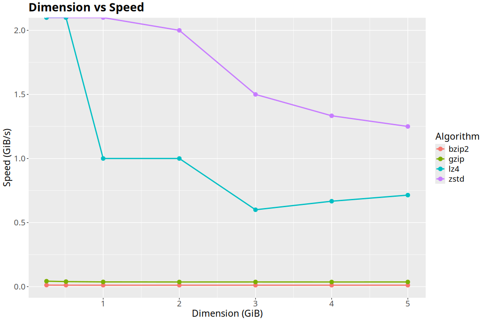

# Compress Stats

This repository is dedicated to providing statistics on the performance of compression algorithms. Here you can find the source code for a C program that uses a syscall to create a file of the desired size filled with random bytes.

## Stats

Dislaimer:
> The following statistics were done on `/dev/zram0` in order to get the best read/write performance. This way the performance is as clean as possible.

From the tests carried out it also appears that `bzip2` has a size reduction **ratio between 0.995 and 0.997** so the size increases. However it must be specified that the file was created **without holes** (empty bits) therefore *impossible to reduce in size*. Therefore the ratio data were not reported here. And since `brotli` is **too slow** to be tested it is not present.

<div style="width: 100%; display: flex; flex-direction: column">


</div>

## How to test compression algorithm?

For example to do this you can use the `tar` tool with the following combination.

```sh
tar cf - file | head -c 4294967296 | lz4 | pv -trab > /dev/null
```

This command creates a tar archive of a file, extracts the first 4 GB, compresses it using the LZ4 algorithm, and displays the compression speed and progress. However, the final compressed output is discarded, as it's directed to /dev/null. Essentially, it's used to measure compression performance without saving the compressed data.

You can use other size (obv) and different algoritm like: `zstd`, `bzip2`, `gzip`, `brotli` and idk.
